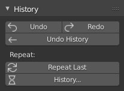

# History_Panel

Brings back the «History» panel with all its history managment including the famous Undo & Redo buttons. But with my polish pass on top.

Made for Blender 2.81 and above.

# Installation

1. Download the python file [history_panel.py](history_panel.py) ;
2. In Blender, go to The menu Edit → Preferences ;
3. In the Preferences window, click the Install bottom on the top right corner ;
4. Find the python file on your storage and click the blue Install Addon button ;
5. The addon should apprear in the list, check its activation box on the top left and close the Preferences.
